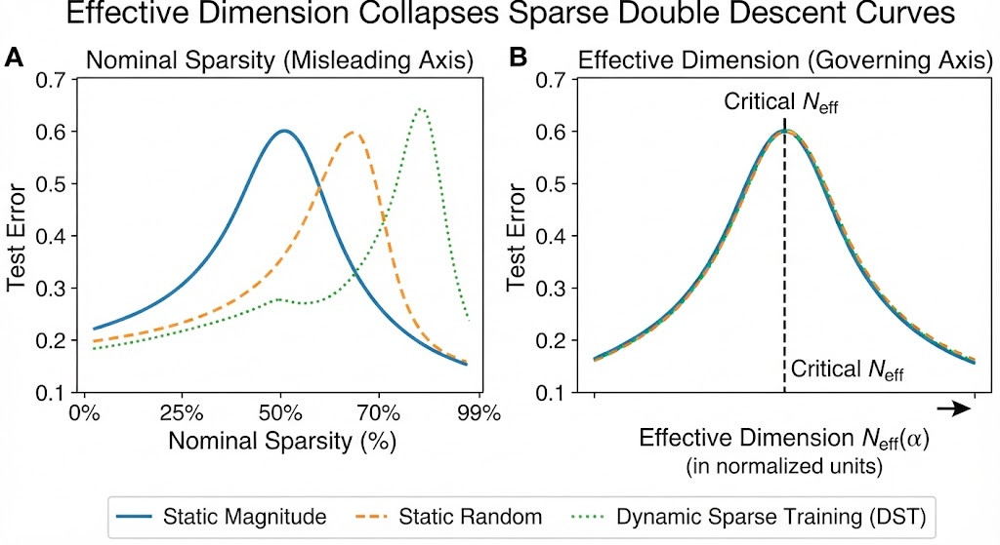
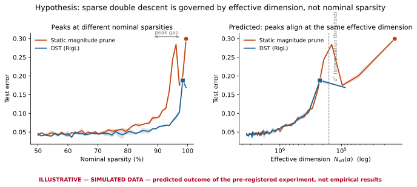

# DynamicSparseTraining

**Does effective dimension — not nominal sparsity — govern where the sparse double descent peak occurs?**

A pre-registered experiment testing whether the test-error peak in sparse networks (He et al., 2022) is located by effective dimension measured from the Hessian eigenspectrum. If true, curves from dynamic sparse training and static pruning — which peak at *different* nominal sparsities — should **collapse onto one curve** when plotted against effective dimension.

[]

[]
## Hypothesis

Curth et al. (2023) showed double descent in classical methods can be an artifact of plotting against the wrong complexity axis. This experiment tests the deep-sparse-network case: nominal sparsity is the wrong axis; effective dimension is the right one.

**Kill condition (pre-registered):** if curves fail to collapse under any of three pre-registered effective-dimension definitions, the hypothesis is falsified. The negative result gets published either way.

## Design

| | |
|---|---|
| Setup | ResNet-18 / CIFAR-10, label noise {0%, 10%, 20%}, 3 seeds |
| Conditions | static magnitude prune · static random prune · DST (RigL) · DST-mask-retrain |
| Sparsity | 10 log-spaced levels, 50%–99.5% |
| Measurement | Hessian eigenspectrum via PyHessian; three effective-dim definitions (Maddox `N_eff(α)`, spectral-gap count, Hutchinson trace) |
| Metric | peak-location spread ratio: effective-dim coords ÷ nominal-sparsity coords |

The mask-retrain condition isolates the mask from training dynamics — if effective dimension governs the peak, a frozen DST mask retrained from scratch lands on the same collapsed curve.

Full pre-registered plan: [`preregistration.md`](preregistration.md) *(frozen before first run)*

## Status

- [x] Literature review — gap confirmed (no prior work uses effective dimension predictively for SDD peak location)
- [ ] Pre-registration frozen
- [ ] SDD baseline replication (He et al. setup)
- [ ] PyHessian pipeline + estimator noise CIs
- [ ] Phase 1 (60 runs)
- [ ] Preprint

## Repository

```
├── preregistration.md      # frozen hypotheses, conditions, metrics
├── src/                    # training, pruning/DST, Hessian measurement
├── configs/                # per-condition run configs
├── results/                # per-run metrics + eigenspectra
└── analysis/               # collapse plots, peak-location stats
```

## Key references

He et al., *Sparse Double Descent* (ICML 2022) · Curth et al., *A U-Turn on Double Descent* (NeurIPS 2023) · Maddox et al., *Rethinking Parameter Counting* (2020) · Evci et al., *RigL* (ICML 2020) · Yao et al., *PyHessian* (2020)

## License

MIT
